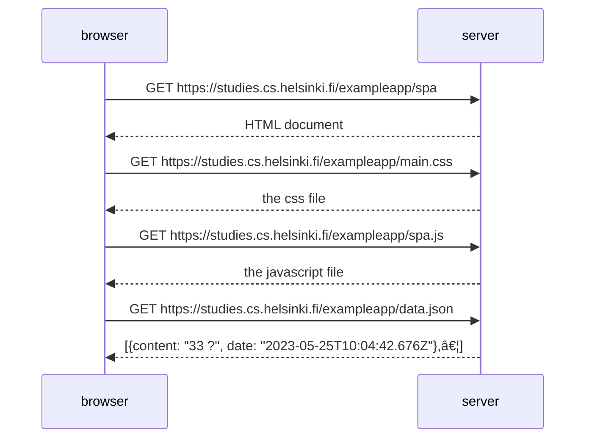

```mermaid
sequenceDiagram
    participant browser
    participant server

    browser->>server: GET https://studies.cs.helsinki.fi/exampleapp/spa
    server-->>browser: HTML document

    browser->>server: GET https://studies.cs.helsinki.fi/exampleapp/main.css
    server-->>browser: the css file

    browser->>server: GET https://studies.cs.helsinki.fi/exampleapp/spa.js
    server-->>browser: the javascript file

    browser->>server: GET https://studies.cs.helsinki.fi/exampleapp/data.json
    server-->>browser: [{content: "33 ?", date: "2023-05-25T10:04:42.676Z"},…]
```